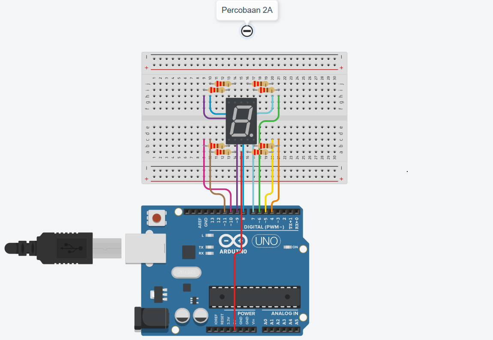

**Nama** : Muhammad Aziz Ihza Fahriza Salam  
**NIM** : H1H024050  
**Mata Kuliah** : TK244005-Praktikum Sistem Mikrokontroller  

---

## Jawaban Pertanyaan Praktikum 2.5.4 (Percobaan 2A: Seven Segment)

**1.Gambarkan rangkaian schematic yang digunakan pada percobaan!**


**2. Apa yang terjadi jika nilai num lebih dari 15?**
Jika nilai variabel `num` yang dilemparkan ke dalam fungsi `displayDigit(int num)` bernilai lebih dari 15, program akan mengalami out-of-bounds memory access (mengakses indeks di luar batas array). Hal ini dikarenakan array `digitPattern` dideklarasikan dengan ukuran `[16][8]` yang berarti indeks maksimalnya hanya sampai 15. Pada mikrokontroler, mengakses indeks di luar batas array akan menyebabkan program membaca data acak di memori, sehingga pola LED yang menyala pada *seven segment* menjadi tidak beraturan, atau bahkan dapat menyebabkan mikrokontroler mengalami crash.

**3. Apakah program ini menggunakan common cathode atau common anode? Jelaskan alasannya!**
Program ini menggunakan rangkaian Common Cathode. 
**Alasannya:** Pada kode program, nilai `1` yang berarti `HIGH` digunakan untuk menyalakan segmen LED. Secara prinsip elektronika, agar LED dapat menyala ketika diberikan logika `HIGH` dari pin output Arduino, maka ujung pin lain dari LED tersebut (yaitu kaki katodanya) harus terhubung secara bersama-sama ke Ground(GND). Konfigurasi menyatukan semua kaki katoda ke GND inilah yang disebut sebagai Common Cathode.

**4. Modifikasi program agar tampilan berjalan dari F ke 0 beserta penjelasannya:**

```cpp
#include <Arduino.h>

// Mendefinisikan array konstan untuk pemetaan pin segmen (a, b, c, d, e, f, g, dp)
const int segmentPins[8] = {7, 6, 5, 11, 10, 8, 9, 4}; 

// Mendefinisikan pola nyala LED untuk angka 0-9 dan huruf A-F (Common Cathode: 1=Nyala, 0=Mati)
byte digitPattern[16][8] = {
  {1,1,1,1,1,1,0,0}, // Indeks 0: Pola angka 0
  {0,1,1,0,0,0,0,0}, // Indeks 1: Pola angka 1
  {1,1,0,1,1,0,1,0}, // Indeks 2: Pola angka 2
  {1,1,1,1,0,0,1,0}, // Indeks 3: Pola angka 3
  {0,1,1,0,0,1,1,0}, // Indeks 4: Pola angka 4
  {1,0,1,1,0,1,1,0}, // Indeks 5: Pola angka 5
  {1,0,1,1,1,1,1,0}, // Indeks 6: Pola angka 6
  {1,1,1,0,0,0,0,0}, // Indeks 7: Pola angka 7
  {1,1,1,1,1,1,1,0}, // Indeks 8: Pola angka 8
  {1,1,1,1,0,1,1,0}, // Indeks 9: Pola angka 9
  {1,1,1,0,1,1,1,0}, // Indeks 10: Pola huruf A
  {0,0,1,1,1,1,1,0}, // Indeks 11: Pola huruf b
  {1,0,0,1,1,1,0,0}, // Indeks 12: Pola huruf C
  {0,1,1,1,1,0,1,0}, // Indeks 13: Pola huruf d
  {1,0,0,1,1,1,1,0}, // Indeks 14: Pola huruf E
  {1,0,0,0,1,1,1,0}  // Indeks 15: Pola huruf F
};

void displayDigit(int num) {
  for(int i=0; i<8; i++) { // Melakukan perulangan 8 kali untuk 8 pin segmen
    digitalWrite(segmentPins[i], digitPattern[num][i]); 
  }
}

void setup() {
  for(int i=0; i<8; i++) { 
    pinMode(segmentPins[i], OUTPUT); // Mengatur setiap pin segmen sebagai OUTPUT
  }
}

void loop() {
  for(int i=15; i>=0; i--) { 
    displayDigit(i); // Memanggil fungsi untuk menampilkan karakter saat ini
    delay(1000);     // Memberikan jeda waktu 1000 milidetik (1 detik) sebelum berganti karakter
  }
}