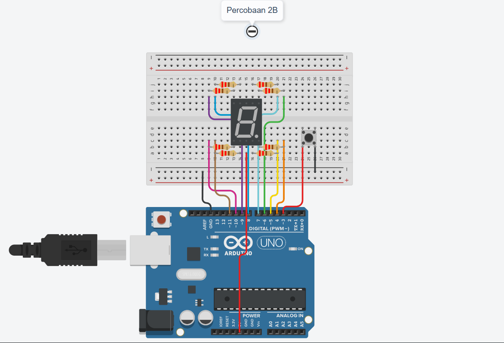

**Nama** : Muhammad Aziz Ihza Fahriza Salam  
**NIM** : H1H024050  
**Mata Kuliah** : TK244005-Praktikum Sistem Mikrokontroller  

---

## Jawaban Pertanyaan Praktikum 2.6.4 (Percobaan 1B: Kontrol Counter Dengan Push Button)

**1. Gambarkan rangkaian schematic yang digunakan pada percobaan!**


**2. Mengapa pada push button digunakan mode `INPUT_PULLUP` pada Arduino Uno? Apa keuntungannya dibandingkan rangkaian biasa?**

Penggunaan mode `INPUT_PULLUP` pada saat inisialisasi `pinMode()` bertujuan untuk mengaktifkan resistor pull-up internal (sekitar 20k Ohm) yang sudah tertanam di dalam mikrokontroler ATmega pada papan Arduino Uno. 

**Keuntungannya:** **Efisien secara Rangkaian (Hardware):** Kita tidak perlu lagi memasang resistor pull-up atau pull-down eksternal secara fisik di breadboard, sehingga rangkaian menjadi jauh lebih ringkas dan hemat kabel.
* **Mencegah Status Mengambang (Floating):** Menjamin bahwa saat push button tidak ditekan, pin Arduino akan membaca sinyal secara stabil di logika `HIGH` (karena ditarik ke 5V oleh resistor internal). Tanpa pull-up, pin akan berada dalam kondisi mengambang dan bisa secara acak membaca logika HIGH atau LOW akibat gangguan elektromagnetik di sekitarnya. 

**3. Jika salah satu LED segmen tidak menyala, apa saja kemungkinan penyebabnya dari sisi hardware maupun software?**

**Dari Sisi Hardware:**
* Kabel jumper yang menghubungkan pin Arduino ke kaki segmen tersebut putus, longgar, atau tertancap di lubang breadboard yang salah.
* Resistor 220 Ohm yang terhubung sebagai pembatas arus ke segmen tersebut rusak atau kakinya tidak menempel dengan baik (kontak kurang bagus).
* Lampu LED mikro untuk segmen spesifik tersebut di dalam komponen Seven Segment memang sudah putus/rusak (bisa karena cacat komponen atau terbakar akibat arus berlebih sebelumnya).

**Dari Sisi Software:**
* Terdapat kesalahan deklarasi pola (typo) pada array biner di dalam variabel `digitPattern` misalnya, segmen yang seharusnya bernilai `1` untuk menyala malah diketik `0`.
* Terjadi kesalahan pemetaan urutan nomor pin Arduino di dalam array `segmentPins` misal pin tertukar posisinya atau salah memasukkan angka pin.
* Logika looping pada saat inisialisasi `pinMode()` di dalam fungsi `setup()` tidak mencakup seluruh rentang array (misal kondisinya hanya `i<7` padahal ada 8 pin), sehingga ada pin segmen yang tidak dideklarasikan sebagai `OUTPUT` dan gagal mengirimkan tegangan.

**4. Modifikasi rangkaian dan program dengan dua push button yang berfungsi sebagai penambahan (increment) dan pengurangan (decrement):**

**Modifikasi Rangkaian Fisik:**
Selain tombol "UP" yang sudah terhubung ke **Pin 2**, tambahkan satu buah push button lagi untuk fungsi "DOWN". Hubungkan salah satu kaki tombol baru tersebut ke **Pin 3** Arduino, dan hubungkan kaki di seberangnya langsung ke jalur **GND** (sama persis dengan prinsip tombol pertama karena kita tetap menggunakan fitur `INPUT_PULLUP` bawaan Arduino).

**Kode Program Lengkap (dengan penjelasan per baris):**

```cpp
// Mendefinisikan array pin Arduino yang terhubung ke tiap segmen (A, B, C, D, E, F, G, DP)
const int segmentPins[8] = {7, 6, 5, 11, 10, 8, 9, 4}; 

const int btnNext = 3;  // Menentukan pin 3 untuk tombol maju (Next)
const int btnPrev = 2;  // Menentukan pin 2 untuk tombol mundur (Prev)

int currentDigit = 0;             // Variabel untuk menyimpan angka/karakter yang sedang ditampilkan saat ini
bool lastBtnNextState = HIGH;     // Menyimpan status sebelumnya dari tombol Next (HIGH berarti tidak ditekan)
bool lastBtnPrevState = HIGH;     // Menyimpan status sebelumnya dari tombol Prev (HIGH berarti tidak ditekan)

// Array 2 dimensi yang berisi pola nyala/mati (1/0) segmen untuk angka 0-9 dan huruf A-F (Hexadesimal)
byte digitPattern[16][8] = {
  {1,1,1,1,1,1,0,0},  // Pola untuk angka 0
  {0,1,1,0,0,0,0,0},  // Pola untuk angka 1
  {1,1,0,1,1,0,1,0},  // Pola untuk angka 2
  {1,1,1,1,0,0,1,0},  // Pola untuk angka 3
  {0,1,1,0,0,1,1,0},  // Pola untuk angka 4
  {1,0,1,1,0,1,1,0},  // Pola untuk angka 5
  {1,0,1,1,1,1,1,0},  // Pola untuk angka 6
  {1,1,1,0,0,0,0,0},  // Pola untuk angka 7
  {1,1,1,1,1,1,1,0},  // Pola untuk angka 8
  {1,1,1,1,0,1,1,0},  // Pola untuk angka 9
  {1,1,1,0,1,1,1,0},  // Pola untuk huruf A
  {0,0,1,1,1,1,1,0},  // Pola untuk huruf b
  {1,0,0,1,1,1,0,0},  // Pola untuk huruf C
  {0,1,1,1,1,0,1,0},  // Pola untuk huruf d
  {1,0,0,1,1,1,1,0},  // Pola untuk huruf E
  {1,0,0,0,1,1,1,0}   // Pola untuk huruf F
};

// Fungsi khusus untuk menampilkan angka/karakter ke 7-segment berdasarkan indeksnya
void displayDigit(int num)
{
  for(int i = 0; i < 8; i++) // Melakukan perulangan sebanyak 8 kali untuk ke-8 segmen
  {
    // Mengirim sinyal ke pin. Tanda '!' membalik logika (1 jadi LOW, 0 jadi HIGH). Cocok untuk tipe Common Anode.
    digitalWrite(segmentPins[i], !digitPattern[num][i]); 
  }
}

void setup()
{
  for(int i = 0; i < 8; i++) // Melakukan perulangan untuk mengatur semua pin segmen
  {
    pinMode(segmentPins[i], OUTPUT); // Mengatur setiap pin segmen sebagai OUTPUT
  }

  pinMode(btnNext, INPUT_PULLUP); // Mengatur pin tombol Next sebagai INPUT dengan resistor pull-up internal
  pinMode(btnPrev, INPUT_PULLUP); // Mengatur pin tombol Prev sebagai INPUT dengan resistor pull-up internal

  displayDigit(currentDigit); // Menampilkan digit awal (yaitu 0) ke layar saat pertama menyala
}

void loop()
{
  bool btnNextState = digitalRead(btnNext); // Membaca status tombol Next saat ini (ditekan = LOW)
  bool btnPrevState = digitalRead(btnPrev); // Membaca status tombol Prev saat ini (ditekan = LOW)

  // Mengecek apakah tombol Next baru saja ditekan (transisi dari tidak ditekan/HIGH menjadi ditekan/LOW)
  if(lastBtnNextState == HIGH && btnNextState == LOW) 
  {
    currentDigit++; // Menambah nilai digit sebanyak 1 (maju)
    if(currentDigit > 15) currentDigit = 0; // Jika sudah melewati batas maksimal (15 atau F), kembali ke 0

    displayDigit(currentDigit); // Memperbarui tampilan 7-segment dengan digit yang baru
    delay(200); // Memberikan jeda 200ms untuk debouncing (mencegah tombol terbaca ditekan berkali-kali)
  }

  // Mengecek apakah tombol Prev baru saja ditekan (transisi dari HIGH ke LOW)
  if(lastBtnPrevState == HIGH && btnPrevState == LOW)
  {
    currentDigit--; // Mengurangi nilai digit sebanyak 1 (mundur)
    if(currentDigit < 0) currentDigit = 15; // Jika kurang dari 0, melompat ke angka paling atas (15 atau F)

    displayDigit(currentDigit); // Memperbarui tampilan 7-segment
    delay(200); // Memberikan jeda 200ms untuk debouncing
  }

  lastBtnNextState = btnNextState; // Menyimpan status tombol Next saat ini untuk perbandingan di loop berikutnya
  lastBtnPrevState = btnPrevState; // Menyimpan status tombol Prev saat ini untuk perbandingan di loop berikutnya
}